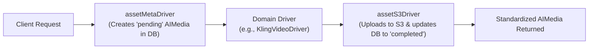

# Building A Full-Lifecycle AI Toolkit

Developing an enterprise-grade AI Toolkit requires more than simple API wrappers; it demands standardized domain models, multi-vendor failover, and composable persistence pipelines.

## Core Architecture & Standardization

To support diverse AI modalities (Chat, Image, Video, Music, Speech) across multiple aggregators and direct API providers, the toolkit establishes a rigorous separation of concerns. Every capability adheres to declarative IRPC contracts, standardized domain entities, and composable middleware pipelines.

### Standardized Domain Entities

Every modality transforms vendor-specific payloads into unified domain entities before returning them to the client or persistence layer.

```typescript
// Shared lifecycle states for asynchronous generation
export type AITaskStatus = 'pending' | 'processing' | 'completed' | 'failed';

// Standardized entity for Media Generation (Image, Video, Music, Speech)
export interface AIMedia {
  id: string;
  status: AITaskStatus;
  modality: 'image' | 'video' | 'music' | 'speech';
  model: string;          // e.g., 'kling@v3.0' or 'flux@v2-max'
  prompt: string;
  url?: string;           // Final storage CDN URL or vendor temporary URL
  thumbnailUrl?: string;
  duration?: number;      // In seconds (for video, music, speech)
  dimensions?: { width: number; height: number }; // For image, video
  error?: string;
  metadata: Record<string, unknown>;
  createdAt: number;
  updatedAt: number;
}

// Standardized entity for Chat & LLM Generation
export interface AIMessage {
  id: string;
  role: 'system' | 'user' | 'assistant' | 'tool';
  content: string;
  model: string;          // e.g., 'gemini@v3.5-flash' or 'claude@v5-sonnet'
  toolCalls?: Array<{ id: string; name: string; arguments: Record<string, unknown> }>;
  usage?: { promptTokens: number; completionTokens: number; totalTokens: number };
  createdAt: number;
}
```

### The Composable Middleware Pipeline

Adapters compose domain drivers, transport drivers, and storage/persistence drivers using `.use(...)`. Each driver in the chain reads and mutates shared execution metadata (`meta`).



#### 1. Pre-Execution Persistence Driver (`assetMetaDriver`)
Intercepts the request before AI inference starts. It assigns a unique task ID, inserts an initial `AIMedia` record into the database with `status: 'pending'`, and mutates `meta.assetId`.

#### 2. Domain & Transport Execution Drivers
Matches `meta.model` against supported identifiers. If matched, it formats the domain parameters into standardized transport payloads (`AIInput`), invokes the transport driver (`KIEDriver`, `POYODriver`, or Direct API), and mutates `meta` with raw vendor outputs (`meta.rawUrl`, `meta.vendorTaskId`).

#### 3. Post-Execution Storage Driver (`assetS3Driver`)
Intercepts the completed execution. If `meta.rawUrl` is present, it streams the asset to permanent S3/R2 storage, updates the database record to `status: 'completed'`, and ensures the final returned object is a pristine `AIMedia` instance.

---
## Modality Matrix & Frontier Model Drivers

Based directly on live reference documentation from [docs.kie.ai/llms.txt](https://docs.kie.ai/llms.txt), the initial release supports exclusively frontier models across five core modalities.

### 1. Chat & LLM Modality (`chat`)

Provides conversational reasoning, structured output generation, and agentic tool use.

| Model Identifier | Kie.ai Target Model / Route | Key Capabilities & Target Use Case |
| :--- | :--- | :--- |
| `gemini@v3.5-flash` | `Gemini 3.5 Flash` | Flagship speed and reasoning balance; recommended default for coding and agentic workflows. |
| `gemini@v3.1-pro` | `Gemini 3.1 Pro (openai)` | High-end complex reasoning, deep multi-step planning, and large-context analysis. |
| `claude@v5-sonnet` | `Claude Sonnet 5` | Frontier agentic capabilities, precise tool invocation, and streaming support. |
| `claude@v4.8-opus` | `Claude Opus 4.8` | Flagship enterprise reasoning, complex judgment, and architectural synthesis. |
| `gpt@v5.5` | `GPT 5.5` | Advanced reasoning model for agentic coding and multi-step task execution. |

#### Driver Implementation Specification
- **`KieChatDriver`**: Routes standardized domain chat messages to Kie.ai's chat completions endpoints (`/market/chat/*` and `/market/gemini/*`). Supports streaming responses and tool invocations.

---

### 2. Video Generation Modality (`video`)

Generates high-definition cinematic video clips from text prompts, reference images, or existing videos.

| Model Identifier | Kie.ai Target Route / API | Key Capabilities & Target Use Case |
| :--- | :--- | :--- |
| `kling@v3.0` | `Kling 3.0` (`/market/kling/kling-3-0`) | Production standard video generation with multi-shot capabilities and reference element control. |
| `seedance@v2.0` | `Bytedance Seedance 2.0` | High-fidelity cinematic video generation with rapid rendering (`Seedance 2.0 Fast`). |
| `wan@v2.7` | `Wan 2.7` (`/market/wan/2-7-text-to-video`) | Advanced video creation, reference-to-video (`2-7-r2v`), and video editing (`2-7-videoedit`). |
| `veo@v3.1` | `Veo3.1 API` | Native 1080P and 4K video generation and extension capabilities. |
| `runway@aleph` | `Runway API Aleph` | High-end dynamic AI video-to-video and text-to-video generation. |

#### Driver Implementation Specification
- **`KieVideoDriver`**: Normalizes prompt, reference image (`image_urls`), aspect ratio, and motion parameters into Kie.ai Market video endpoints. Implements task polling via `Get Task Details` (`/market/common/get-task-detail`).

---

### 3. Image Generation Modality (`image`)

Generates photorealistic images, graphic design assets, and in-context edits.

| Model Identifier | Kie.ai Target Route / API | Key Capabilities & Target Use Case |
| :--- | :--- | :--- |
| `flux@v2-pro` | `Flux-2 Pro Text / Image to Image` | Top-tier professional image generation and editing with intricate prompt adherence. |
| `flux@kontext` | `Flux Kontext API` | Dedicated context-aware image generation and editing task endpoint. |
| `4o-image@latest` | `4o Image API` | OpenAI 4o Image generation tasks with direct download URL conversion. |
| `seedream@v5-lite`| `Seedream 5.0 Lite` | High-quality photorealistic text-to-image and image-to-image generation. |
| `imagen@v4-ultra` | `Google Imagen4 Ultra` | Google's flagship ultra-high-fidelity image generation model. |

#### Driver Implementation Specification
- **`KieImageDriver`**: Normalizes generation dimensions, reference images, and editing tasks into Kie.ai image endpoints, incorporating `Get Direct Download URL` callbacks to resolve cross-domain asset links.

---

### 4. Music Generation Modality (`music`)

Produces full-track musical compositions with vocals or instrumental arrangements.

| Model Identifier | Kie.ai Target Route / API | Key Capabilities & Target Use Case |
| :--- | :--- | :--- |
| `suno@v4.5` / `v5` | `Suno API` (`generate-music`) | Full song generation supporting custom lyrics, V4_5 style boosting (`boost-music-style`), and custom personas. |
| `suno@extend` | `Suno API` (`extend-music`) | Seamless track continuation and stem separation (`separate-vocals`, `generate-midi`). |

#### Driver Implementation Specification
- **`SunoMusicDriver`**: Translates structured options (instrumental vs vocal, style booster, cover generation, timestamped lyrics request) directly to Kie.ai's comprehensive Suno API endpoints.

---

### 5. Speech & Voice Synthesis Modality (`speech`)

Converts text into natural, emotionally resonant human speech.

| Model Identifier | Kie.ai Target Route / API | Key Capabilities & Target Use Case |
| :--- | :--- | :--- |
| `elevenlabs@v3` | `elevenlabs/text-to-dialogue-v3` | Multi-speaker dialogue text-to-speech generation with high emotional expression. |
| `elevenlabs@turbo-2.5`| `elevenlabs/text-to-speech-turbo-2-5`| Low-latency conversational speech synthesis. |
| `elevenlabs@v2-multi` | `elevenlabs/text-to-speech-multilingual-v2` | Rich multilingual vocal narration. |

#### Driver Implementation Specification
- **`ElevenLabsSpeechDriver`**: Normalizes text payloads, voice IDs, and stability settings into Kie.ai ElevenLabs market endpoints.

---
## Persistence Layer & Pipeline Integration

To support production workloads without tying developers to a single ORM or cloud provider, the persistent lifecycle is implemented through pluggable driver contracts.

### Persistence Driver Contracts

```typescript
export interface AIMediaStorageDriver {
  save(media: AIMedia): Promise<AIMedia>;
  findById(id: string): Promise<AIMedia | null>;
  updateStatus(id: string, status: AITaskStatus, updates?: Partial<AIMedia>): Promise<AIMedia>;
}

export interface AIAssetCDNStorageDriver {
  upload(sourceUrlOrBuffer: string | ArrayBuffer, path: string): Promise<string>;
}
```

### Proposed Directory & File Structure

```
airlib/irpc/aikit/src/
├── adapter.ts                 # Base AIAdapter and AINextAdapter logic
├── types.ts                   # Core AIInput, AIOutput, and Driver definitions
├── entities/                  # Standardized domain entities
│   ├── media.ts               # AIMedia interface & Zod schemas
│   └── message.ts             # AIMessage interface & Zod schemas
├── persistence/               # Lifecycle & persistence middleware drivers
│   ├── asset-meta.driver.ts   # Pre-execution metadata driver
│   ├── asset-s3.driver.ts     # Post-execution S3/R2 storage driver
│   └── chat-meta.driver.ts    # Chat message log driver
├── drivers/                   # Transport & execution infrastructure drivers
│   ├── kie-ai/index.ts        # Kie.ai aggregator driver
│   └── poyo-ai/index.ts       # Poyo.ai aggregator driver
├── chat/                      # Chat modality declaration & drivers
│   ├── index.ts               # Package & schema definitions
│   ├── adapter.ts             # ChatAdapter
│   ├── gemini/driver.ts       # Gemini 3.5 Flash / Pro driver
│   └── claude/driver.ts       # Claude 5 Sonnet / Opus driver
├── image/                     # Image modality declaration & drivers
│   ├── index.ts
│   ├── adapter.ts
│   └── flux/driver.ts         # Flux.2 Max / Pro driver
├── video/                     # Video modality declaration & drivers
│   ├── index.ts
│   ├── adapter.ts
│   └── kling/driver.ts        # Kling 3.0 / Omni driver
├── music/                     # Music modality declaration & drivers
│   ├── index.ts
│   ├── adapter.ts
│   └── suno/driver.ts         # Suno v5 driver
└── speech/                    # Speech modality declaration & drivers
    ├── index.ts
    ├── adapter.ts
    └── elevenlabs/driver.ts   # ElevenLabs v3 / Flash driver
```

---

## Verification Plan

### Automated Testing
- **Unit Tests (`bun test`)**:
  - Test `AIMedia` and `AIMessage` Zod validation across valid/invalid inputs.
  - Verify adapter chain-of-responsibility fallback when a model identifier is unhandled (`IRPCAdapter.next()`).
  - Test transport failover when API keys are missing or provider returns rate-limit errors (`AIAdapter.next()`).
- **Mock Persistence Pipeline Test**:
  - Attach in-memory storage drivers (`MockAssetMetaDriver`, `MockS3Driver`) to verify lifecycle transitions from `pending` -> `processing` -> `completed`.

### Manual & Integration Verification
- Execute end-to-end integration scripts against live API keys (in staging/dev environments) for each supported frontier model (`kling@v3.0`, `flux@v2`, `suno@v5`, `gemini@v3.5-flash`, `elevenlabs@v3`).
- Verify that asset URLs returned to clients point to final CDN locations rather than ephemeral vendor storage.
